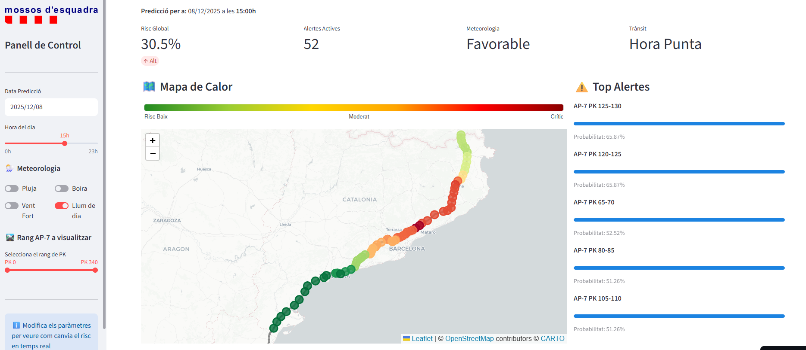
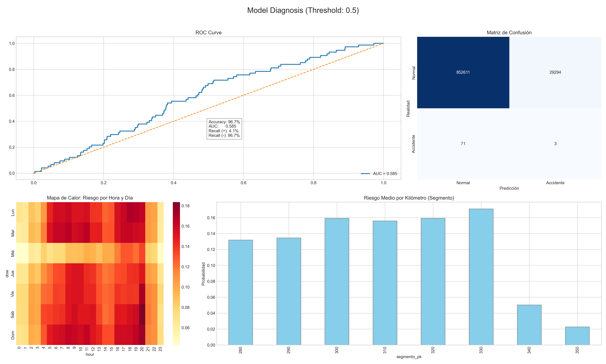

# 🚔 Sistema de Predicción de Riesgo de Accidentes (Ruta Valencia - Vera)


Un panel de control impulsado por Machine Learning que predice la probabilidad de accidentes de tráfico a lo largo de la **ruta Valencia -> Vera** (A-3, A-31, A-30, A-7). Analizando geometría vial y condiciones meteorológicas, este sistema proporciona una evaluación de riesgos en tiempo real para mejorar la seguridad vial.

<div align="center">

## 🔴 **Demo en Vivo**
Haz clic en la imagen de abajo para lanzar el panel interactivo:

[](https://predict-vehicle-accidents.streamlit.app/)

*Explora mapas de calor de riesgo en tiempo real, simulación meteorológica y pronósticos de 24h.*

</div>

---

## 📖 Resumen del Proyecto

Este proyecto tiene como objetivo predecir el **Riesgo Binario de Accidente (Accidente vs. No Accidente)** para segmentos específicos de 10km de la carretera. Utiliza **XGBoost**, un algoritmo de gradient boosting, entrenado con datos sintéticos generados para la ruta **Valencia - Honrubia - Albacete - Murcia - Vera**.

El sistema tiene en cuenta:
* **Características Temporales:** Hora del día, día de la semana, mes (codificación cíclica).
* **Meteorología:** Lluvia, viento, humedad, niebla (datos de Open-Meteo).
* **Infraestructura:** Geometría de la carretera, límites de velocidad y puntos específicos de riesgo.
* **Cruces de Características:** Interacciones complejas como `carretera_mojada_de_noche` o `viento_en_zonas_criticas`.

## 📸 Validación del Modelo y Rendimiento

El modelo fue validado utilizando una división de series temporales. Se prestó especial atención a la **Sensibilidad (Recall)** para minimizar los falsos negativos (no detectar un accidente potencial).


*(Arriba: Panel de diagnóstico generado por `validation.py`, mostrando Curva ROC, Matriz de Confusión y Mapas de Calor).*

**Métricas Clave:**
* **ROC AUC:** Indica la capacidad del modelo para distinguir entre situaciones seguras y peligrosas.
* **Recall:** Optimizado para asegurar que las situaciones de alto riesgo sean señaladas.
* **Análisis de Mapa de Calor:** Visualiza que el modelo identifica correctamente las horas punta y condiciones adversas como periodos de mayor riesgo.

---

## 🚀 Características

### 1. Panel Interactivo (`app_demo.py`)
* **Mapa de Calor de Riesgo en Tiempo Real:** Visualiza niveles de riesgo en un mapa Folium superpuesto a la geometría oficial de la ruta.
* **Simulación de Escenarios:** Interruptores para Lluvia, Niebla o Viento para ver cómo las condiciones afectan la seguridad.
* **Pronóstico de 24 Horas:** Predice la evolución del riesgo para las próximas 24 horas basado en ciclos temporales.
* **Top Alertas:** Identifica los puntos kilométricos (PK) específicos con el mayor peligro inmediato.

### 2. Tubería de Datos Robusta
* **`geometry_coordinates.py`**: Obtiene el trazado exacto de la ruta usando la **Overpass API (OpenStreetMap)**.
* **`get_weather_data.py`**: Obtiene datos meteorológicos históricos de estaciones virtuales a lo largo de la ruta vía **Open-Meteo API**.
* **`create_dataset.py`**: Fusiona cuadrículas espaciotemporales, maneja valores faltantes y realiza ingeniería de características.

---

## 📂 Estructura del Proyecto

```bash
├── app/
│   ├── app_demo.py          # Aplicación principal del Dashboard Streamlit
│   └── geometry_coordinates.py
├── data/
│   ├── route_geometry.geojson # Geometría de la ruta generada
│   ├── meteo_history/       # Datos meteorológicos históricos
│   └── AP7_Final_Training_Set.csv # Dataset final (nombre heredado)
├── models/
│   └── accident_xgboost.pkl # Modelo ML entrenado
├── scripts/
│   ├── get_weather_data.py
│   ├── generate_synthetic_data.py
│   └── create_dataset.py # (En raíz o scripts)
├── train_xgboost.py
├── validation.py
├── requirements.txt
└── README.md
```

---

## 🛠️ Instalación y Uso

### 1. Clonar el repositorio
```bash
git clone https://github.com/adrianaavilees/Vehicle-Accident-Predictor.git
cd Vehicle-Accident-Predictor
```

### 2. Instalar Dependencias
```bash
pip install -r requirements.txt
```

### 3. Generación de Datos (Opcional si los datos están presentes)
Si deseas reconstruir el conjunto de datos desde cero, ejecuta los scripts en este orden:

```bash
# 1. Obtener geometría de la carretera desde OpenStreetMap
python app/geometry_coordinates.py

# 2. Obtener datos meteorológicos desde Open-Meteo
python scripts/get_weather_data.py

# 3. Generar accidentes sintéticos
python scripts/generate_synthetic_data.py

# 4. Crear el conjunto de datos de entrenamiento (fusiona accidentes + meteo + geometría)
python create_dataset.py
```

### 4. Entrenar el Modelo
```bash
python train_xgboost.py
```
*Esto generará el archivo `accident_xgboost.pkl` en la carpeta `models/`.*

### 5. Ejecutar el Panel localmente
Para lanzar la app de Streamlit en tu máquina local:
```bash
streamlit run app/app_demo.py
```

---

## 🔗 Referencias y Fuentes de Datos

La precisión de este modelo se basa en datos abiertos y sintéticos para demostración.

### Datos Históricos (Entrenamiento del Modelo)
* **Accidentes de Tráfico:** Datos sintéticos generados para simular patrones realistas en la ruta Valencia-Vera.
* **Contexto Meteorológico:** [Open-Meteo API](https://open-meteo.com/)
    *Datos meteorológicos históricos de reanálisis para correlacionar accidentes con condiciones ambientales.*

### Datos en Tiempo Real (Inferencia y Validación)
* **API Meteorológica:** [MeteoCat API / Open-Meteo](https://open-meteo.com/)
    *(Simulado en la demo)*.

---
<div align="center">
  Hecho con ❤️ usando Python y Streamlit
</div>
